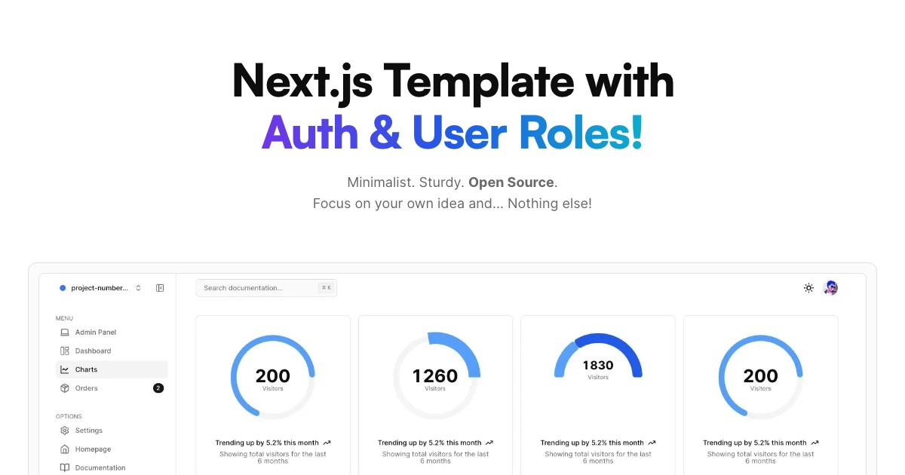
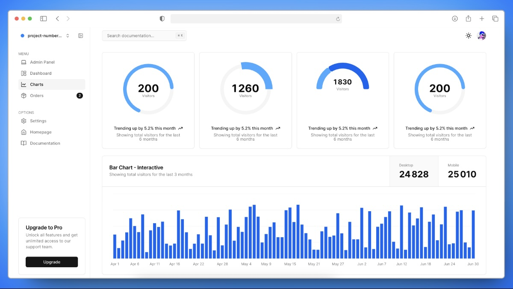

<a href="https://next-auth-roles-template.vercel.app">
  
  <h1 align="center">Next Auth Roles Template</h1>
</a>

<p align="center">
  Start at full speed with this Next.js Template !
</p>

<p align="center">
  <a href="https://twitter.com/miickasmt">
    
  </a>
</p>

<p align="center">
  <a href="#installation"><strong>Installation</strong></a> ·
  <a href="#tech-stack--features"><strong>Tech Stack + Features</strong></a> ·
  <a href="#author"><strong>Author</strong></a>
</p>
<br/>

## Installation

Clone & create this repo locally with the following command:

```bash
npx create-next-app my-saas-project --example "https://github.com/mickasmt/next-auth-roles-template"
```

Or, deploy with Vercel:

[](https://vercel.com/new/clone?repository-url=https%3A%2F%2Fgithub.com%2Fmickasmt%2Fnext-auth-roles-template)

### Steps

1. Install dependencies using pnpm:

```sh
pnpm install
```

2. Copy `.env.example` to `.env.local` and update the variables.

```sh
cp .env.example .env.local
```

3. Start the development server:

```sh
pnpm run dev
```

4. Remove parts you don't want

You can use the command `pnpm run remove-content` in your terminal to remove specific parts of your project. This command supports the following parameters:

- **--blog**: Removes the blog section from your project.
- **--docs**: Removes the documentation section from your project.

#### Recommendations

- **Remove Both Sections**: It is recommended to use `pnpm run remove-content` without specifying parameters (`--blog` or `--docs`). This ensures that all associated documents are properly removed, as some documents may not be deleted/updated if you remove "blog" after "docs" or vice versa.

#### Examples

1. To remove both the blog and documentation sections:

```bash
pnpm run remove-content
```

2. To remove only the blog section:

```bash
pnpm run remove-content --blog
```

3. To remove only the documentation section:

```bash
pnpm run remove-content --docs
```

> [!NOTE]  
> I use [npm-check-updates](https://www.npmjs.com/package/npm-check-updates) package for update this project.
>
> Use this command for update your project: `ncu -i --format group`

## Tech Stack + Features



### Frameworks

- [Next.js](https://nextjs.org/) – React framework for building performant apps with the best developer experience
- [Auth.js](https://authjs.dev/) – Handle user authentication with ease with providers like Google, Twitter, GitHub, etc.
- [Prisma](https://www.prisma.io/) – Typescript-first ORM for Node.js
- [React Email](https://react.email/) – Versatile email framework for efficient and flexible email development

### Platforms

- [Vercel](https://vercel.com/) – Easily preview & deploy changes with git
- [Resend](https://resend.com/) – A powerful email framework for streamlined email development
- [Neon](https://neon.tech/) – Serverless Postgres with autoscaling, branching, bottomless storage and generous free tier.

### UI

- [Tailwind CSS](https://tailwindcss.com/) – Utility-first CSS framework for rapid UI development
- [Shadcn/ui](https://ui.shadcn.com/) – Re-usable components built using Radix UI and Tailwind CSS
- [Lucide](https://lucide.dev/) – Beautifully simple, pixel-perfect icons
- [`next/font`](https://nextjs.org/docs/basic-features/font-optimization) – Optimize custom fonts and remove external network requests for improved performance
- [`ImageResponse`](https://nextjs.org/docs/app/api-reference/functions/image-response) – Generate dynamic Open Graph images at the edge

### Hooks and Utilities

- `useIntersectionObserver` – React hook to observe when an element enters or leaves the viewport
- `useLocalStorage` – Persist data in the browser's local storage
- `useScroll` – React hook to observe scroll position ([example](https://github.com/mickasmt/precedent/blob/main/components/layout/navbar.tsx#L12))
- `nFormatter` – Format numbers with suffixes like `1.2k` or `1.2M`
- `capitalize` – Capitalize the first letter of a string
- `truncate` – Truncate a string to a specified length
- [`use-debounce`](https://www.npmjs.com/package/use-debounce) – Debounce a function call / state update

### Code Quality

- [TypeScript](https://www.typescriptlang.org/) – Static type checker for end-to-end typesafety
- [Prettier](https://prettier.io/) – Opinionated code formatter for consistent code style
- [ESLint](https://eslint.org/) – Pluggable linter for Next.js and TypeScript

### Miscellaneous

- [Vercel Analytics](https://vercel.com/analytics) – Track unique visitors, pageviews, and more in a privacy-friendly way

## Author

This project is based on [Next SaaS Stripe Starter](https://next-saas-stripe-starter.vercel.app/).

Created by [@miickasmt](https://twitter.com/miickasmt) in 2023, released under the [MIT license](https://github.com/shadcn/taxonomy/blob/main/LICENSE.md).

## Credits

Thanks to [Hosna Qasmei](https://twitter.com/hqasmei) for part of the dashboard sidebar code.